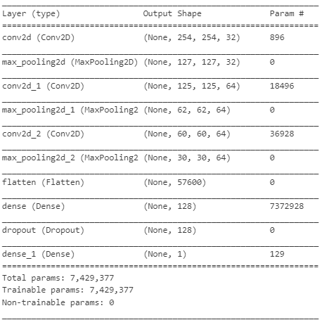

## Dataset Content
* The dataset is sourced from [Kaggle](https://www.kaggle.com/codeinstitute/cherry-leaves). We then created a fictitious user story where predictive analytics can be applied in a real project in the workplace.
* The dataset contains +4 thousand images taken from the client's crop fields. The images show healthy cherry leaves and cherry leaves that have powdery mildew, a fungal disease that affects many plant species. The cherry plantation crop is one of the finest products in their portfolio, and the company is concerned about supplying the market with a compromised quality product.

## Business Requirements
The cherry plantation crop from Farmy & Foods is facing a challenge where their cherry plantations have been presenting powdery mildew. Currently, the process is manual verification if a given cherry tree contains powdery mildew. An employee spends around 30 minutes in each tree, taking a few samples of tree leaves and verifying visually if the leaf tree is healthy or has powdery mildew. If there is powdery mildew, the employee applies a specific compound to kill the fungus. The time spent applying this compound is 1 minute.  The company has thousands of cherry trees, located on multiple farms across the country. As a result, this manual process is not scalable due to the time spent in the manual process inspection.

To save time in this process, the IT team suggested an ML system that detects instantly, using a leaf tree image, if it is healthy or has powdery mildew. A similar manual process is in place for other crops for detecting pests, and if this initiative is successful, there is a realistic chance to replicate this project for all other crops. The dataset is a collection of cherry leaf images provided by Farmy & Foods, taken from their crops.

* 1 - The client is interested in conducting a study to visually differentiate a healthy cherry leaf from one with powdery mildew.
* 2 - The client is interested in predicting if a cherry leaf is healthy or contains powdery mildew.

## Hypothesis and how to validate?
* We suspect powdery mildew leaves have clear marks/signs, typically the white powder can be seen and can be any where on the leaf..

* An Image Montage shows that typically a powdery mildew leafs white marks over it. Average Image, Variability Image and Difference between Averages studies did not reveal a clear pattern to differentiate one from another.

## The rationale to map the business requirements to the Data Visualisations and ML tasks
* 1 - The client is interested in conducting a study to visually differentiate a healthy cherry leaf from one with powdery mildew.
This is address on the dashboard as leaves Visualiser Radio button. Clicking on this will trigger the model culculating the difference between the health leaves and also give you a gallery with and image montage for all
 
* 2 - The client is interested in predicting if a cherry leaf is healthy or contains powdery mildew. This is addressed by uploading a leaf from anywhere on client data base and the model will let them know if it is healthy or infected with powdery mildew. There by addressing the second requirement.

## ML Business Case
* Our Model is a good model becase it performs well on test data but most importantly on Validation Data, the date that it has not seen before.  Below snip show that as Model losses decrease the accuracy improves proving that there no over fitting or under fitting. Moreover the Validation moves allong with the model Evidenced by Model History below.

The Generalised Performance on Test Set Show 99.29% accuracy and a loss at its minimum of 2.3%.  The model is reliable better than what the client requested (95%).

## Dashboard Design
* List all dashboard pages and their content, either blocks of information or widgets, like buttons, checkboxes, images, or any other items, that your dashboard library supports.

## Main Data Analysis and Machine Learning Libraries

* numpy==1.19.2 helped me to be able to perform mathematical operations.

* os - helped me to navigate the operating system to create directories.

* Shutil helped with the handling of high level files 

* pandas==1.1.2  helped me to be able to put my data into data frames.
* matplotlib==3.3.1 Helped me to be able to plot the bar graphs 
* seaborn==0.11.0 Helped me to visualised data in a comparable and neat way.
* plotly==4.12.0 Helped me to visualised data in a comparable and neat way.
see below mean variability of leaves diagram produced by the above mention ploting libraries:

* itertools helped with the creation of the image montage gallery:

* seaborn helped me visualise the split between the trained, tested and validated data set with a Bar graph below:

* streamlit==0.85.0 Help me with prototyping and front end presatation via a deshboard.
* python-3.11.9
* scikit-learn==0.24.2
* tensorflow-cpu==2.6.0 Helps to supply the deep neural network for deep learning and build the model.
* keras==2.6.0 Helped with the preprocessing and aurgument the data to produce more images that were not in the data set by applying various variation methods and 
normalisation like rotating shifting zooming and later load images as an array to prepare them for w the convolution neural network.

* from tensorflow.keras.models  Sequential models learns step by step or layer by layer.
* from tensorflow.keras.layers  Activation, Dropout, Flatten, Dense, Conv2D, MaxPooling2D help to produce the model:

## Credits 

* Gyan Shashwat - Code institute Walk through project. Helped me with the understanding of building the model and the prototype and a lot of libraries and algorithyms associated with deep learning.

* Stack Overflow,Jonrsharpe Nov 20 2020, explaining the Reason behind the -> None in the initializer function, anabling me to keep it.

### Content 

- The text for the Home page was taken from Wikipedia Article A.
- Instructions on how to implement form validation on the Sign-Up page were taken from [Specific YouTube Tutorial](https://www.youtube.com/).
- The icons in the footer were taken from [Font Awesome](https://fontawesome.com/).

